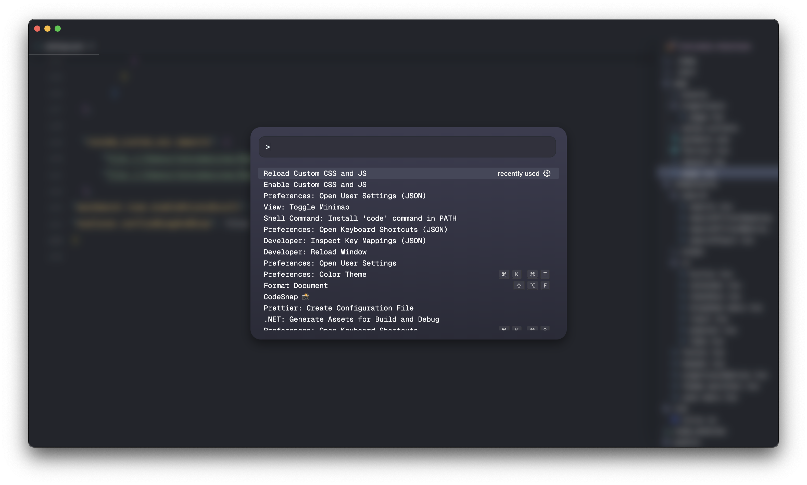
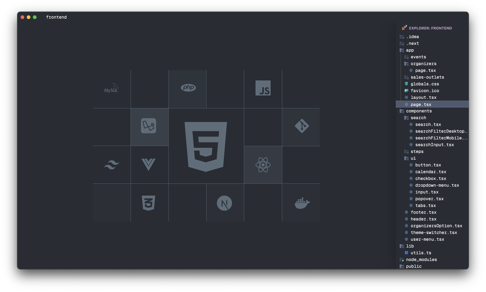
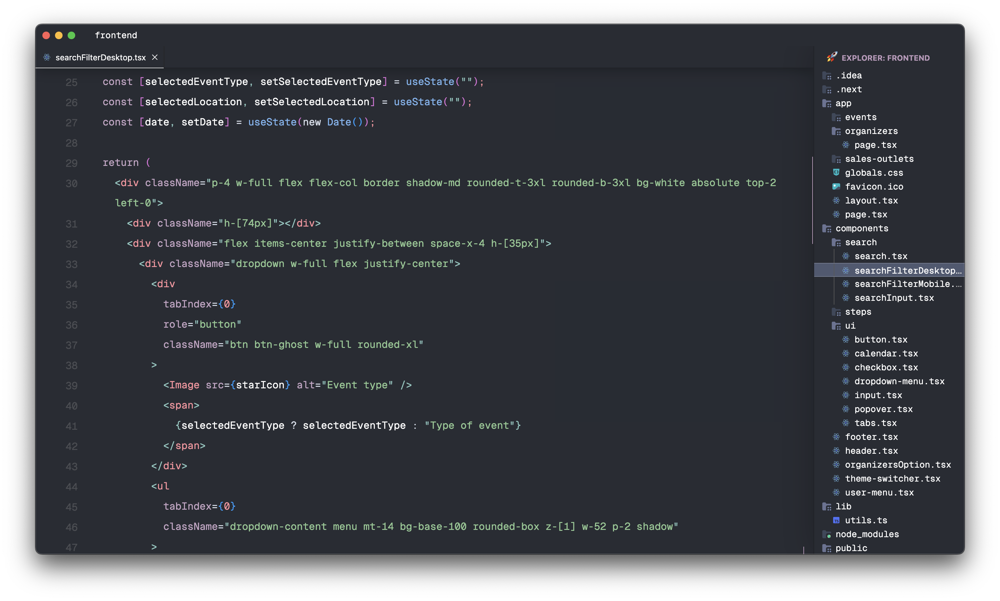
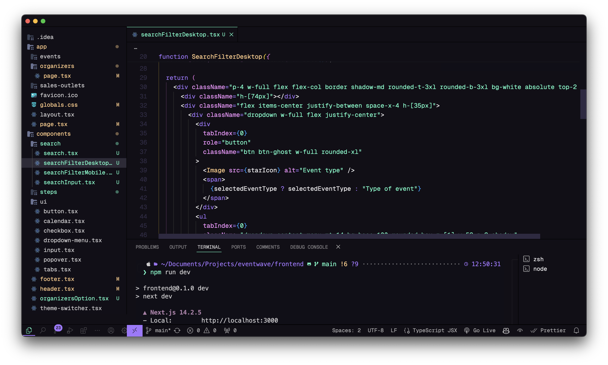

# VSCode Settings

This repository contains a custom `settings.json` files that enhance the UI of Visual Studio Code with specific fonts and other UI configurations.

## Features: `settings1.json`

- **Theme**: React Theme
- **Icon Theme**: Moxer Icons
- **Fonts**:
  - Editor: Geist Mono
  - Terminal: JetBrainsMono Nerd Font
- **UI Tweaks**:
  - Minimap disabled
  - Custom scrollbar settings
  - Custom title bar and status bar
  - Custom CSS and JS files
  - Custom Command Pallete







## Features: `settings2.json`

- **Theme**: Aura Soft Dark (Soft Text)
- **Icon Theme**: Moxer Icons
- **Fonts**:
  - Editor: Geist Mono
  - Terminal: JetBrainsMono Nerd Font
- **UI Tweaks**:
  - Minimap disabled
  - Custom scrollbar settings
  - Custom title bar and status bar



## Installation

1. **Clone the Repository**:
   ```bash
   git clone https://github.com/marinactonci/vscode-settings.git
   ```

2. **Copy either `settings1.json` or `settings2.json`:**
   - Replace your existing `settings.json` file located in:
     ```sh
     ~/.config/Code/User/settings.json
     ```
   - Or open VSCode, go to `Preferences` > `Settings`, and choose `Open Settings (JSON)` to paste the contents.

3. In case your selected to use the `settings1.json` you'll also need to install `Custom CSS and JS Loader` extension and inside of the `settings.json` change the paths to the custom css and js files to paths the files are located in on your system. Finally, open Command Pallete and run `Enable Custom CSS and JS`.

## Usage

After installation, restart VSCode to apply the new settings. Ensure that the fonts mentioned are installed on your system.


# MacOS Terminal

## Install Homebrew if you haven't already:

```bash
/bin/bash -c "$(curl -fsSL https://raw.githubusercontent.com/Homebrew/install/HEAD/install.sh)"
```

After installing, add it to the path (replace `[username]` with your atual username):

```bash
echo 'eval "$(/opt/homebrew/bin/brew shellenv)"' >> /Users/[username]/.zprofile
eval "$(/opt/homebrew/bin/brew shellenv)"
```

You can cherck whether homebrew is installed by running:

```bash
brew --version
```

## Alacritty

```bash
brew install --cask alacritty
```

## Install font for icons

```bash
brew install font-meslo-lg-nerd-font
```

## Configure Alacritty

```bash
mkdir -p ~/.config/alacritty
cd ~/.config/alacritty
touch alacritty.toml
nano alacritty.toml
```

```
[env]
TERM = "xterm-256color"

[window]
padding.x = 10
padding.y = 10

decorations = "Buttonless"

opacity = 0.8
blur = true

option_as_alt = "Both"

[font]
normal.family = "MesloLGS Nerd Font Mono"
size = 19
```

## Install PowerLevel10k theme

```bash
brew install powerlevel10k
```

Run the following command to add a line to `.zshrc` to set powerlevel10k as your theme:

```bash
echo "source $(brew --prefix)/share/powerlevel10k/powerlevel10k.zsh-theme" >>~/.zshrc

source ~/.zshrc
```

Choices:
- Lean
- Unicode
- 8 colors
- 24-hour format
- Two lines
- Dotted
- Left
- Black
- Sparse
- Many icons
- Concise
- Transient prompt: No
- Verbose

You can restart the powerlevel10k config by:
```bash
p10k configure
```

## Setup theme colors

```bash
git clone https://github.com/alacritty/alacritty-theme.git themes

curl https://raw.githubusercontent.com/josean-dev/dev-environment-files/main/.config/alacritty/themes/themes/coolnight.toml --output ~/.config/alacritty/themes/themes/coolnight.toml
```

Open `alacritty.toml` file again and add the following code to the top of the file:

```
import = [
  "~/.config/alacritty/themes/themes/coolnight.toml"
]
```

## Better history completion

```bash
nano ~/.zshrc
```

Add the following code to the bottom of the file
```
# History setup
HISTFILE=$HOME/.zhistory
SAVEHIST=1000
HISTSIZE=999
setopt share_history
setopt hist_expire_dups_first
setopt hist_ignore_dups
setopt hist_verify

bindkey "^[[A" history-search-backward
bindkey "^[[B" history-search-forward
```

```bash
source ~/.zshrc
```

## Zsh Autosuggestions

```bash
brew install zsh-autosuggestions

echo "source $(brew --prefix)/share/zsh-autosuggestions/zsh-autosuggestions.zsh" >> ~/.zshrc
source ~/.zshrc
```

## Zsh Syntax Highlighting

```bash
brew install zsh-syntax-highlighting

echo "source $(brew --prefix)/share/zsh-syntax-highlighting/zsh-syntax-highlighting.zsh" >> ~/.zshrc
source ~/.zshrc
```

## Better ls (eza)

```bash
brew install eza

nano ~/.zshrc
```

Add following line to the bottom:

```
alias ls="eza --color=always --long --no-filesize --icons=always --no-time --no-user --no-permissions"
```

Reload configuration:

```bash
source ~/.zshrc
```

## Better cd (zoxide)

```bash
brew install zoxide
```

Add the following two lines at the bottom:

```
alias cd="z"

eval "$(zoxide init zsh)"
```

Reload configuration:

```bash
source ~/.zshrc
```

For more info follow the [blog post](https://www.josean.com/posts/how-to-setup-alacritty-terminal).
